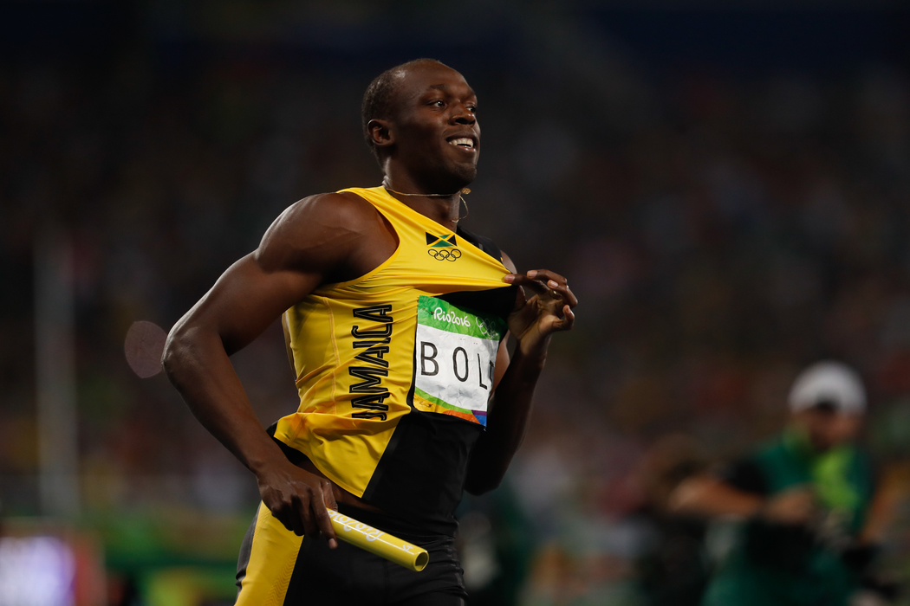

### Best Relay Team problem

Let's kick off the blog with [Best Relay Team](https://open.kattis.com/problems/bestrelayteam)!

The blurb: you are a trainer and you have to select a relay team of four runners. But careful! Some runners are better on the first leg and some are better on following legs of the run, when warm.



So what are you going to do with this? You are offered up to 500 people to build your dream team. My first thought was of course: this opens too many horrifying combinatorics possibilities! Do you _really_ need to match all the runners against each other?

But while in my insanely irritating and almost stagnant commute, I realised that ... **you don't need the slow ones!** Of course, each starting runner has to be paired with three others "warm runners". But those warm runners need to be the fastest ones, not the slugs that are slowing down the whole team!\* So listen to your inner French :fr: and put those warm snails back in the kitchen where they belong :snail: !

So the solution is to pick every runner as front runner, put her/him (politely) on the side and select thereafter the three fastest warm runners.

\*<small>⚠️ all accurate comparison with your humble servant's performance in her own team are hurtful to the author's feelings. </small>

### Solution based on hashtables

My first solution is made with Python dictionaries (hashtables). That code has a face only a mother can love, but the idea is simple.

#### Method to create two dictionaries

One method makes two dictionnaries: send all the runners to a method that returns two dictionaries. One for the "start-time" performance, one for the "warm time" performance.

For example, we read the line "BOLT 9.58 8.43", and make two dictionaries. One for Bolt's start time (9.58), and his warm time (8.43).

```python
def make_dictionnaries(runners):
    for i in range(0, len(runners_array), 3):
        start_times[runners_array[i]] = float(runners_array[i+1])
        warm_times[runners_array[i]] = float(runners_array[i+2])

```

#### Method to match each first-leg with the three best second-leg

This is the method where the French cooking happens.

For each runner, we take the best team mates _while excluding the current runner_ and compare all possible times.

- we start with infinite time, like my commute to work
- we select everyone _except_ the current runner, who waits politely on the side for team mates to be selected,
- we sort them with `sorted()` method, by `key=lambda x: x[1]`, that is to say, the second element of the dictionary (warm time)
- and add the three best times to the variable team's time `teams_time`,

```python
def find_best_team(start, warm):
    ideal_time = float("inf")
    best_start_runner = ""
    followers = []

    for key in start:
        # selecting everyone while ignoring (politely) the current runner
        others = {k: v for k, v in warm.items() if k is not key}
        # sort warm times by best performance
        srtd_others = sorted(others.items(), key=lambda x: x[1])
        # add times to the team's time
        teams_time = start[key] + srtd_others[0][1] + srtd_others[1][1]
         + srtd_others[2][1]
```

And when the time is the best we've seen so far, make the team!

```python
        if teams_time < ideal_time:
            ideal_time = teams_time
            best_start_runner = key
            best_team = [srtd_others[0][0], srtd_others[1][0],
             srtd_others[2][0]]
```

### Time complexity and Big-Oh notation

It's still a blog on algorithms, so I should probably write something about the time complexity.
This solution creates two dictionnaries 2 times _O(n)_, then sorts _O(n log n)_, if I remember the algorithm course correctly, and copies one of them _O(n)_... So many useless operations!

**All of this is Big-nOh-nOh**. Don't do it at home.

#### Better solution:

A better solution would be:

- read each runner information in one line, name, start and warm times
- sort the runners based on their warm times with this line:
  `runners.sort(key=lambda x: float(x[2]))`

  ⚠️: **Don't miss the conversion to float!** (I did aaaand... :arrow_right: wrong answer:x:). Remember the input is a String. Runner's time will be sorted as string, i.e, 2 seconds will be considered bigger than 19 seconds.

- add the front runner to the team instead of politely waiting on the side. The front runner is now the captain,
- for each runner, append the next three best runners based on warm times (while not the captain `front_runner != next_runner`) and keep adding folk as long as the team is less than four people `len(team) < 4`
- check if we have the best time and build the dream team!

```python
def get_best_team(sorted_runners):
    best_time = float("inf")
    best_team = []
    for front_runner, start, warm in sorted_runners:
        running_time = float(start)
        team = [front_runner]
        for next_runner, start2, warm2 in sorted_runners:
            if (front_runner != next_runner) and len(team) < 4:
                running_time += float(warm2)
                team.append(next_runner)
        if running_time < best_time:
            best_time = running_time
            dream_team = team
```

What about Big-Oh now? We have _O(n log n)_ (one sorting ) + _O(n)_ (appending a team to each runner), so (maybe) _O(n)_.

Here is the whole solution. Do not hesitate to tweak it!

```python
def get_best_team(sorted_runners):
    best_time = float("inf")
    dream_team = []
    for front_runner, start, warm in sorted_runners:
        running_time = float(start)
        team = [front_runner]
        for next_runner, start2, warm2 in sorted_runners:
            if (front_runner != next_runner) and len(team) < 4:
                running_time += float(warm2)
                team.append(next_runner)
        if running_time < best_time:
            best_time = running_time
            dream_team = team
    print(best_time)
    print('\n'.join(dream_team))

number_of_lines = int(input())
runners = []
for i in range(number_of_lines):
    runners.append(input().split())
runners.sort(key=lambda x: float(x[2]))
get_best_team(runners)
```
