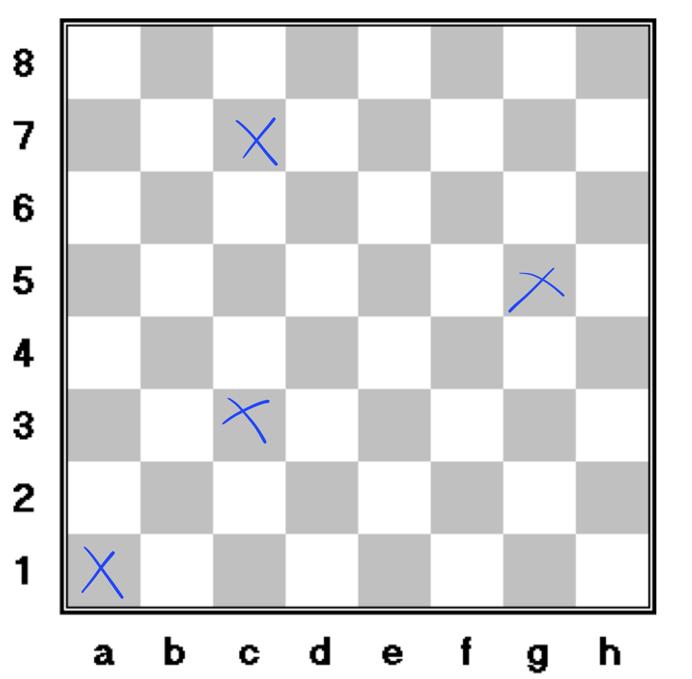

This week's challenge will be Kattis [Chess](https://open.kattis.com/problems/chess)!

This problem has much likely a graph solution. But since I am ~~still terrified of graphs~~ very creative, I streched my brain to find another, easier solution.

And here it is.

### Straightforward solution, with middle school math.

The only thing to realize with this problem is that bishop move in diagonals, upwards or downwards. Any Bishop can reach any square of the same color by moving diagonaly. If two Bishops are on the same color, they can **always** reach each other **as long as they stand on the same color.** '
That's why people play to chess. Imagine the boredom otherwise!

Our job is to identify the two lines and where they intersect.

You don't believe me? Here comes the ultimate proof.

### Proof by visualisation

One image is worth a thousand words, and definitely 32 678 (signed) math theorems.

And one gif is probably worth a thousand images.

Here comes a proof at the power of <small>⚠️</small>: $$1000 \times 1000 \times 32675 = 32 675 000 0000$$

<small>⚠️ Yes. It's call a proof by exageration.</small>

`youtube: https://youtu.be/NOcga2qKKNU`

### What do we need to do in our code?

Four things dear friends.

1. We need to check if the bishop is already on the position it is trying to reach. Easy.

```cpp
 if (x1 == x2 && y1 == y2)
```

2. We need to check wether they are on the same diagonal. How? Easy! We read the coordinates of the Bishop and its destination, we normalise the columns with $$A=0, B=1, C=2...$$ and the columns by substracting one to every row(that is, 1 is now zero, 2 is one)... and calculate the slope. Note that the slope is calculated by comparing absolute values and not $$\displaystyle\frac{y_2 - y_1}{x_2 - x_1}$$.

This is to avoid the infamous division by zero, if the input coordinates happened to be the same!

```cpp
abs(x1 - x2) == abs(y1 - y2)
```

Is the slope one or minus one? Bingo. They are on the same diagonal.

3. We also need to check wether they are on the same color at all! How do we do that? Easy! We add the **normalized coordinates** of the origin, and we compare it with the normalized destination. Both must be even, or odd.

   

Example: A 1 will be $$0 + 0 = 0$$.

C 3 will be $$2 + 2 = 4$$.

Both are even, and we can conclude A 1 can reach C 3.
What about C 7 ? Well, it will be $$2 + 6 = 8$$, also even!

What about G 5 ? It would be $$6+ 4 = 10$$, also even! Therefore reachable from A 1. I hope I managed to convince you with those examples. Trying with the white squares and covering the whole board is left as an irritating and meaningless exercise to the reader.

No really, don't do that. In chess, colors alternate every 2 square. That means that if the result of our first calculation is even and the second is odd, the square do not have the same color and we might as well give up!

```cpp
if ((x1 + y1) % 2 != (x2 + y2) % 2)
printf("Impossible\n");
```

4. Finally, how are we going to verify that the bishop can reach any position of the same color? Just like in my Chef d'Oeuvre, we need to find the intersection between _the diagonal with the start position_ and _the diagonal with the end position_. If this intersection is outside the board, we change the slope of both diagonals, and try the other way, just as Edith Black!

How to create those right lines? Let's say we are given a start position, $$(x_ 1, y_1)$$ and a destination $$(x_ 2, y_2)$$.
A right line equation is under the form of $$y = kx + m$$.
We are on a $$45°$$ diagonal, so the slope (the k value) will always be 1 or -1, right?

The m value, where a right line cross the y-axis will always be the given $$y_{value} - x_{value}$$ in an ascending line and $$y_{value} + x_{value}$$ in a descending line.

If you think about it: if the slope is always one (or minus one), for every step we take to the left, the y-value is "artificially" increased by one (or decreased by one). We just need to compensate!

$$-x + (y_1+x_1)=x+(y_2-x_2)$$

$$2x  = (y_1+x_1) - (y_2-x_2)$$

$$x  = \displaystyle \frac{(y_1+x_1) - (y_2-x_2)}{2}$$

$$ y = x+(y_2-x_2)$$

OR, trying by the other side:

$$x + (y_1 - x_1)=-x+(y_2+x_2)$$

$$2x  = (y_2+x_2)-(y_1+x_1)$$

$$x  = \displaystyle\frac{(y_2+x_2)-(y_1+x_1)}{2}$$

$$ y = x+(y_1 - x_1)$$

In code, that would be:

```cpp
int x = ((y1 + x1) - (y2 - x2)) / 2;
int y = x + (y2 - x2);

    if (x < 0 || x > 7 || y < 0 || y > 7) {
        x = ((y2 + x2) - (y1 - x1)) / 2;
        y = x + (y1 - x1);
    }
```

### Code

And here, at last, my DYI, _O(1)_ solution!

```cpp
#include <iostream>
#include <cstdlib>
#include <algorithm>
#include <string>

using namespace std;

int main() {
    int testCases;
    cin >> testCases;
    cin.ignore(32767, '\n');

    for (int i = 0; i < testCases; i++) {
        char start_row_letter, end_row_letter;
        int column1_int, column2_int;

        cin >> start_row_letter >> column1_int >> end_row_letter >> column2_int;

        int x1 = start_row_letter - 65;
        int x2 = end_row_letter - 65;
        int y1 = column1_int - 1;
        int y2 = column2_int - 1;

        if (x1 == x2 && y1 == y2)
            printf("%d %c %d \n", 0, start_row_letter, column1_int);

        else if (abs(x1 - x2) == abs(y1 - y2))
            printf("%d %c %d %c %d \n", 1, start_row_letter, column1_int, end_row_letter, column2_int);

        else if ((x1 + y1) % 2 != (x2 + y2) % 2)
            printf("Impossible\n");

        else {
            int x = ((y1 + x1) - (y2 - x2)) / 2;
            int y = x + (y2 - x2);

            if (x < 0 || x > 7 || y < 0 || y > 7) {
                x = ((y2 + x2) - (y1 - x1)) / 2;
                y = x + (y1 - x1);
            }
            auto x_temp = (char) (x + 65);
            auto y_temp = y + 1;

            printf("%d %c %d %c %d %c %d \n", 2, start_row_letter, column1_int, x_temp, y_temp, end_row_letter, column2_int);

        }

    }
    return 0;

}

```

### COMING SOON ON WRONG ANSWER !

Cliffhanger !

Stay tuned, because my mentors on Code Ranch deemed this code so horrible that they could not resist to refactor it.
