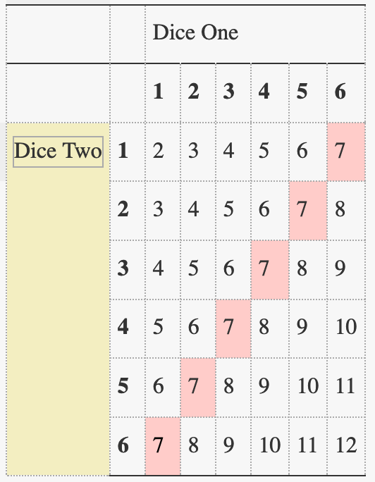
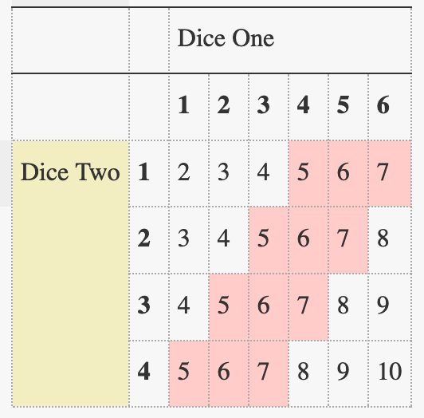

I know what you think:

"No.

She did not dig up a year-old problem from it's grave to talk crappy math?"

But you know what they say. **No shame, no game.**

Besides, it gives me the opportunity to play with repl.

### Brute force solution

So for a year ago, I did this cute problem,
🎲 [Dice cup](https://open.kattis.com/problems/dicecup). The code will be in Java, since it's my first programming language. Besides, when not at home, I'm at the [Ranch](https://coderanch.com/) :cow:.

There is a brute solution, a probabilistic solution, and another solution I am not yet aware of. And it is probable (ha!) that at some point, somebody _might_ read this post and share it with me!

The problem is, given two dice, calculate the most likely sum of both faces. Me, an intellectual of higher abstractions, came with the brilliant idea to _count every possible outcome_.

This beauty is _O(n<sup>2</sup>_).

```java
public class Main {
    public static void main(String[] args) {

        Scanner scan = new Scanner(System.in);
        int dice1 = scan.nextInt();
        int dice2 = scan.nextInt();

        // making some room for our calculations
        int[] results = new int[dice1 * dice2];
        //... and counting frequencies.
        int[] repetitions = new int[dice1 * dice2];

        int max = 0;
        for (int i = 1; i <= dice1; i++) {
            for (int j = 1; j <= dice2; j++) {
                // that's just a trick to put a two dimensional
                //result in a one dimensional array
                results[(i - 1) * dice2 + (j - 1)] = i + j;
                repetitions[i + j] += 1;
                //calculating max frequency at the same time.
                //We're already at O(n^2) so let's not make it worse.
                if (repetitions[i + j] > max) {
                    max = repetitions[i + j];
                }
            }
        }
        System.out.println();
        for (int i = 0; i < repetitions.length; i++) {
            if (repetitions[i] == max)
                System.out.println(i);
        }
    }
}
```

#### Try it yourself!

And here comes the "Try it yourself" embedded code nobody asked for. Push :arrow_forward: and wait a bit.

<iframe height="400px" width="100%" src="https://repl.it/@Dajamante/Rolling-Dice?lite=true" scrolling="no" frameborder="no" allowtransparency="true" allowfullscreen="true" sandbox="allow-forms allow-pointer-lock allow-popups allow-same-origin allow-scripts allow-modals"></iframe>

### Probabilistic solution

I felt my solution was not optimal and asked about in another fantastic forum [Pluggakuten](www.pluggakuten.se) (Really, go there if you have any problem with math, physics or life in general, they will figure it out for you.).

And I got introduced to the fantastic world of probabilities: if we draw a table with all possible outcomes of two dice, some results are more likely to come back more often **and we know which ones!**

Why?

Let's look at a picture.


In the event of two dice, we have 7, that can be obtained by $$1+6$$, $$2+5$$, $$3+4$$, $$4+3$$, $$5+2$$ and $$6+1$$.

Let's look at another picture to see the pattern:



The most likely outcome are the longuest diagonals. It is going to be the number of dots on the smallest dice :beetle:, plus one (contribution from the biggest dice), up to the number of the bigger dice, plus one (contribution from the smallest dice).

With that in mind, the code can be cut to a _O(n)_ solution. But small n.

```java
import java.util.Scanner;

public class Main {

    public static void main(String[] args) {
        Scanner scan = new Scanner(System.in);
        int dice1 = scan.nextInt();
        int dice2 = scan.nextInt();

        //dice 1 must be the small one, so little swap here just in case:
        if (dice2 < dice1) {
            int temp = dice1;
            dice1 = dice2;
            dice2 = temp;
        }
        for (int i = (dice1 + 1); i <= (dice2 + 1); i++)
            System.out.println(i);
    }
}
```

#### Try it yourself!

The compulsory "Try it yourself" you still did not ask for:

<iframe height="400px" width="100%" src="https://repl.it/@Dajamante/Rolling-Dice-2?lite=true" scrolling="no" frameborder="no" allowtransparency="true" allowfullscreen="false" sandbox="allow-forms allow-pointer-lock allow-popups allow-same-origin allow-scripts allow-modals"></iframe>

### "Better-mathematics" solution

I don't have it.

If you do, please share!
