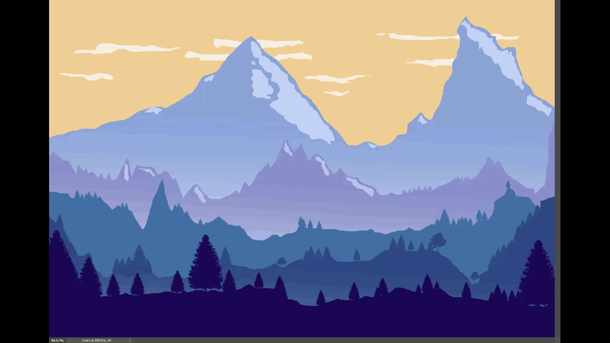

### December turtles

Under hela november har vi fotsätt med olika grafiker och tester med turtles. Nästa år blir det dataspel eller robotar, beroende på omröstning!

### Bakgrund bild

Först ska vi inte glömma att ladda ner en backgrund bild och lägga den i samma map, till exempel detta:



Men såklart vilken bakgrund bild som helst passar bra, det är din story!

### Flera turtles som pratar med varandra

Men hur kan vi göra för att få flera turtles som pratar med varandra? Ett exempel kommer här!

```python
import turtle
import time

skarm = turtle.Screen()
skarm.bgpic("landscape.png")
penna = turtle.Turtle()
penna.hideturtle()


penna.penup()
penna.setposition(0,150)
penna.color('deep pink')
penna.write("Pepo och Papi träffas på landet.",False,
            align='center',font=('Courier', 30, "italic"))
penna.color('black')
time.sleep(3)
penna.clear()
penna.penup()


pepo = turtle.Turtle()
pepo.hideturtle()
pepo.shape('turtle')
pepo.penup()
pepo.setposition(-200,0)
pepo.showturtle()


papi = turtle.Turtle()
papi.hideturtle()
papi.shapesize(6,6)
papi.shapesize(outline=6)
papi.shape('turtle')
papi.penup()
papi.setposition(200,0)
papi.tilt(180)
papi.showturtle()
papi.color("pink", "blue")

pepo.speed(1)
pepo.forward(90)
papi.speed(1)
papi.backward(100)

(pepoX, pepoY) = pepo.position()
(papiX, papiY) = papi.position()

penna.penup()
penna.goto(pepoX, pepoY+60)
time.sleep(1)
penna.write("Hej Papi! \nVad stor du har blivit!",
False, align="center", font=("Arial", 14, "normal"))

penna.goto(papiX, papiY+60)
time.sleep(1)
penna.write("Hej Pepo! \nTack tack!",
False, align="center", font=("Arial", 16, "normal"))
time.sleep(2)

penna.clear()

penna.penup()
penna.goto(pepoX, pepoY+70)
time.sleep(3)
penna.write("Vad äter du då?",
False, align="center", font=("Arial", 20, "normal"))
time.sleep(3)

penna.goto(papiX, papiY+70)
time.sleep(3)
penna.write("Inget! \n Jag är bara programmerat så.\n Kolla din shapesize!",
False, align="center",
font=("Arial", 20, "normal"))
time.sleep(3)
penna.clear()


penna.penup()
penna.goto(pepoX, pepoY+60)
time.sleep(3)
penna.write("Vad fin rosa päls \ndu har fått!",
False, align="center",
font=("Arial", 14, "normal"))
time.sleep(3)

penna.goto(papiX, papiY+80)
time.sleep(3)
penna.write("Tackar! Det är min \nshapesize(outline=6)!\nDu kan också ha en!",
False, align="center", font=("Arial", 16, "normal"))
time.sleep(4)
penna.clear()

penna.penup()
penna.setposition(0,150)
penna.color('deep pink')
penna.write("Tack för att du har tittat!",
False,
align='center',font=("Courier", 30, "italic"))
time.sleep(5)
skarm.clear()
skarm.bye()
```
