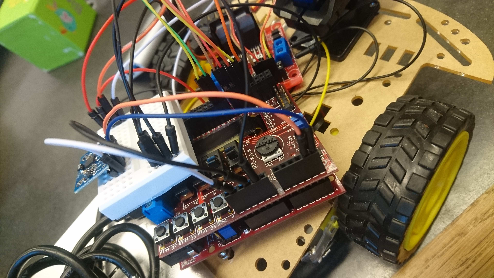

### Obstacle avoiding robot with PIC32MX

When we (my lab parter Johanna Löv) and myself build the JompAi car, we found out that while the code to make the car run is pretty trivial, the configuration of all the registers, timers, I2C, was not :oncoming_automobile:!

We went from the files written by Axel Isaksson and Fredrik Lundevall (distributed by KTH for our lab work), and implemented the changes we needed.



So here are the details promised since december 2019. [Git repo: TheCar](https://github.com/Dajamante/TheCar). The files you might be interested about are i2c.h and mipslabwork.c. Here you can see how we did timers configuration registers, as well as servo motors, interrupts and i2c protocol.

If you are struggling with a similar project, do not hesitate to ask us questions, we'll do our best to help!

```c
void labinit(void)
{
    /* MOTORS*/

  // configured on PORTE 7:4, pins 30:33
  TRISE = 0x00;
  /* Sensor and Switches on PORTD */
  TRISD = 0x320;//bit 8 and 9 of port D are inputs (switch 1 and switch 2)
                //Sensor: bit 11 = trigger is output, bit 5 = echo is input

  /* TIMERS */

  //TMR1 handles sending a pulse every 100ms. It has flag: IFS0<4>
  TMR1 = 0x0; // Clear timer register
  PR1 = ((80e6/256)/10); // 100 ms (needs to be > 60ms time out according to the docs.
  T1CONSET = 0x8030;// Start Timer 1, preschaling with bits 5:4 to 1:256

  //flag: IFS0<12>. Global ticker at 20 micro. Cannot use TMR2 because servo
  TMR3 = 0x0;
  PR3 = (80e6 / 64) / 50000;
  IPC(3) = 0x1E; //set high prio
  T3CONSET = 0x8060;

  //TMR4 handles trigger. Flag IFS0<16> Enable IEC0<16> Prio IPC4<4:2> subprio IPC4<1:0>
  TMR4 = 0x0;
  PR4 = 80e6*1e-5; //time out needs to be 10 us, so the period size is 800
                //TMR4 starts in the user_isr routine
  IPC(4) = 0x1F; //set highest priorities lecture 6 for timer 4
                 // TABLE 7-1: INTERRUPT IRQ AND VECTOR LOCATION PIC32 family manual
  IPC(1) = 0x1D; //set slightly lower priority IPC1<4:2> subprio: IPC1<1:0>

  /* SERVO */

  // configure PWM on OC1 (RD4)
  TMR2 = 0x0; //reset timer
  PR2 = (80e6 / 256) / 50; // 20 ms must be 50hz
  T2CONSET = 0x8070; //T2CON must be 0x70 (bits 6 to 4) for prescaling 1:256

  OC1RS = 469; // set pulse width to 1.5 ms to center servo, ie ((80e6 / 256) / 50)*(1.5/20)
  OC1R = 469; // set pulse width to 1.5 ms to center servo to start? Don't understand

  OC1CONSET = 0x8000; //ON: Output Compare Peripheral On bit
  OC1CONSET = 0x6; //  OCM<2:0>: Output Compare Mode Select bits 110 = PWM mode on OCx; Fault pin disabled

  IEC(0) = 0x11010; //enable interrupt IEC0<16> TMR4 enable: IEC0<4> TMR1, IEC0<12> TM3
  enable_interrupt();

  if(i2CisOn()) i2cinit();
  return;
}
```
