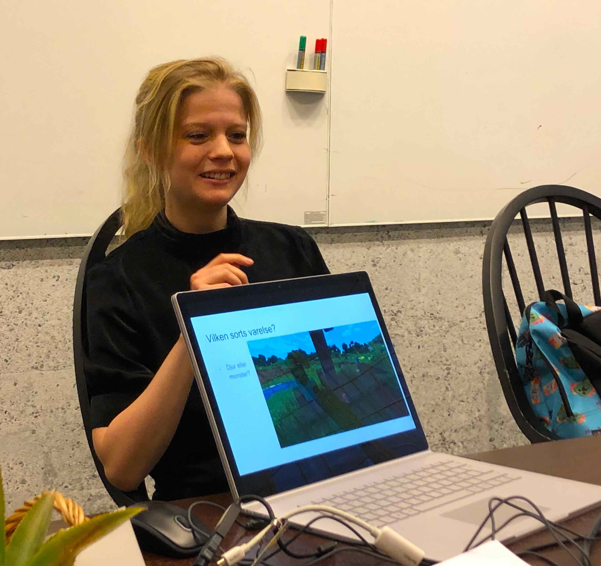
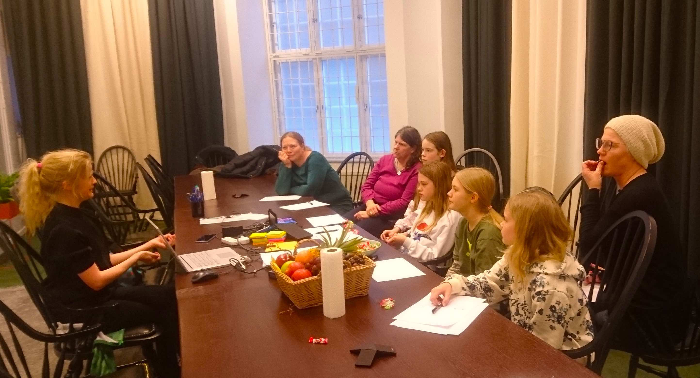
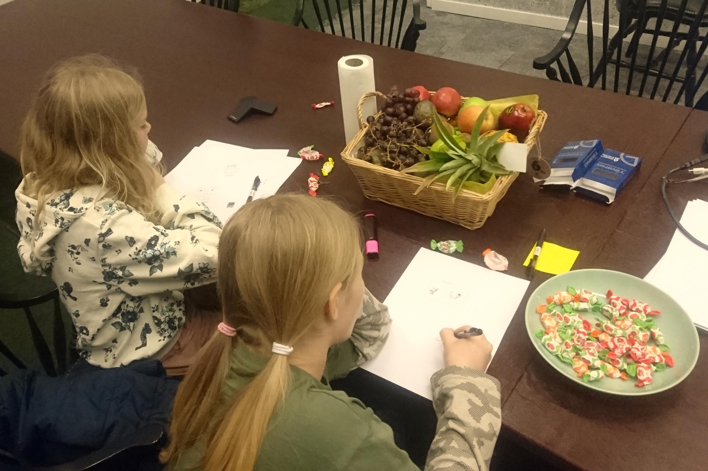
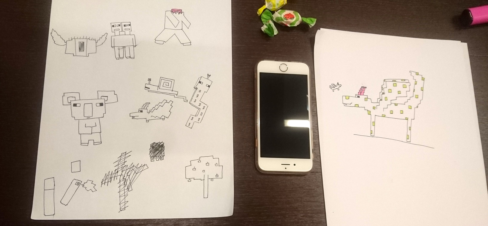

### Mojang besök med Agnes Larsson

Vi passade på sportlovet för att besöka Mojang och den talangfulla Agnes Larsson! Agnes gjorde massor tillägg till Minecraft, enligt [Forbes](https://www.forbes.com/profile/agnes-larsson/#15b4b5e4378b) 😎- och håller underbara workshop for barn!

Vi gick igenom vad man måste tänka på när vi skapar Minecraft karaktärer: hur ska man designa för att behålla andan av den originella spelet? Vad gör en värelse och vad är syften med varelser existens? Godis strömmade in, idéer och förslag strömmade ut.

Vi fick även hem en ironisk drakeget på köpet, som blev vår ny logo (som Edit donerade välidigt snällt!)

